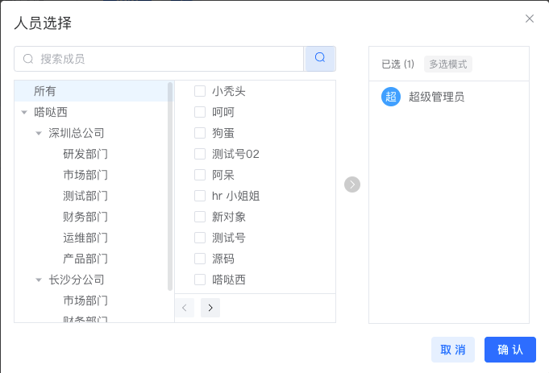

# FluentFlow 工作流系统项目

> 一套基于 Spring Boot + Vue3 构建的企业级工作流引擎解决方案，内核采用 FlowLong（飞龙）工作流，支持灵活配置、流程可视化、权限精细化控制，适用于企业审批、任务分发、流程治理等多种业务场景。

---

## 📦 项目架构

### 🔧 后端技术栈

| 技术组件         | 说明 |
|------------------|------|
| **Spring Boot**  | 容器与服务端开发框架 |
| **MySQL**        | 持久化数据存储 |
| **Flyway**       | 数据库版本管理与迁移 |
| **Redis**        | 缓存中间件，用于任务计数等 |
| **MyBatis Plus** | 高效易用的 ORM 框架 |
| **FlowLong** 🐉  | 轻量级国产工作流引擎，支持流程建模与执行 |

### 🌐 前端技术栈

| 技术组件         | 说明 |
|------------------|------|
| **Vue 3**        | 渐进式前端框架 |
| **Vite**         | 极速构建工具 |
| **Element Plus** | 企业级组件库，构建高质量 UI 界面 |

---

## 🚀 项目亮点

- ✅ **流程模型可视化建模**
- ✅ **支持多节点、多角色、多方式审批**
- ✅ **任务状态实时变更与缓存计数**
- ✅ **丰富的流程事件监听机制**
- ✅ **流程事件统一处理与消息模板推送**
- ✅ **接入简单，可插拔扩展**

---

## 📌 后端核心接口概览

### 📁 任务相关API

| 接口功能           | 方法 | 路径                                 |
|--------------------|------|--------------------------------------|
| 保存流程实例       | POST | `/task/save`                         |
| 发起流程           | POST | `/task/start`                        |
| 获取流程实例状态   | GET  | `/task/status`                      |
| 同意流程           | PUT  | `/task/agree`                       |
| 驳回流程           | PUT  | `/task/reject`                      |
| 终止流程           | PUT  | `/task/terminate`                   |
| 回退任务           | PUT  | `/task/rollback`                    |
| 转交任务           | PUT  | `/task/transfer`                    |
| 加签任务           | PUT  | `/task/countersign`                 |

---

## 💼 功能展示

- 🧾 **流程发起与审批**
- 👥 **多角色审批流转**
- 🔁 **任务退回 / 转交 / 加签**
- ⏰ **任务超时提醒**
- 📊 **任务统计与任务中心视图**
- 🔔 **流程消息提醒（后续支持通道推送）**
- 🔐 **审批权限精细控制**

---

## 🛠️ 项目部署指南（简要）

1. 初始化数据库并执行 Flyway 自动建表。
2. 配置数据库、Redis 等相关连接信息。
3. 启动后端 Spring Boot 服务。
4. 启动前端项目：

```bash
cd front
npm install
npm run dev
``` 
---

## 🔮 系统架构图

```text
+-------------+       +---------------+       +-------------------+
|   用户浏览器 | <---> |   Vue3 + Vite | <---> | SpringBoot API层  |
+-------------+       +---------------+       +-------------------+
                                                   |
                                             +-----v-----+
                                             | FlowLong 🐉 |
                                             +-----+-----+
                                                   |
                                    +--------------v-------------+
                                    |   MySQL + Redis + Flyway   |
                                    +----------------------------+
```

--- 

## 📄 License

> 🚀 本系统基于 FlowLong（[https://aizuda.com](https://aizuda.com)）开源工作流引擎进行集成与增强，遵循其 Apache-2.0 协议及附加授权条款。

本系统基于 [FlowLong 工作流引擎](https://aizuda.com) 进行深度集成，遵循其官方 Dual License 协议：

- ✅ **允许：**
  - 学习、研究、内部系统使用
  - 集成于企业私有项目中（非商业性对外提供）

- ❌ **禁止：**
  - 擅自商用（对外提供服务、SaaS平台、或嵌入付费系统）
  - 删除版权信息或修改协议声明

> 本项目所使用的 FlowLong 工作流组件版权归 [Aizuda 官方](https://aizuda.com) 所有，若需商用，请联系官方购买正版授权。

---

## 🧰 组件使用说明文档

📘 如需了解 `WorkFlowPro` 组件的使用方法，可点击下方链接查看或下载：

👉 [📥 下载 WorkFlowPro 组件使用说明（Markdown）](./back/docs/WorkFlowPro_Usage.md)

---

## 📎 附录：系统界面截图

_以下展示了本系统的部分界面，用于直观了解流程能力：_




---

## 🙌 特别鸣谢

衷心感谢以下优秀开源项目，为本系统提供强大支撑：

| 技术 | 链接 |
|------|------|
| 🐉 FlowLong 工作流引擎 | https://aizuda.com |
| 💡 MyBatis Plus | https://baomidou.com |
| 🖼️ Vue 3 | https://vuejs.org |
| ⚡ Vite | https://vitejs.dev |
| 🧩 Element Plus | https://element-plus.org |

---

> 💬 **技术是生产力，开源让世界更美好。**